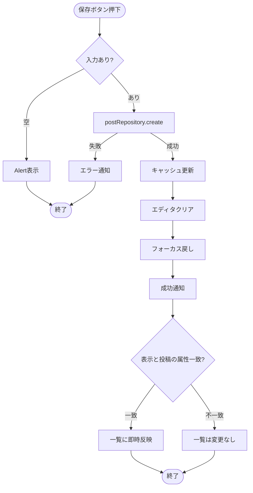
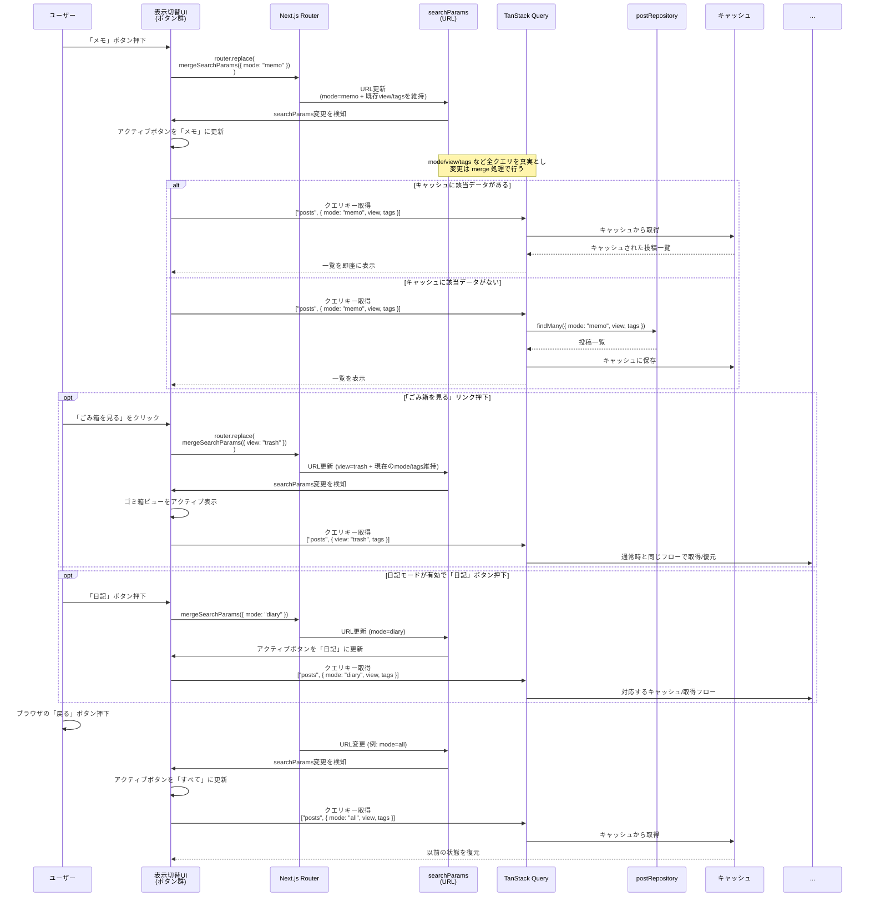
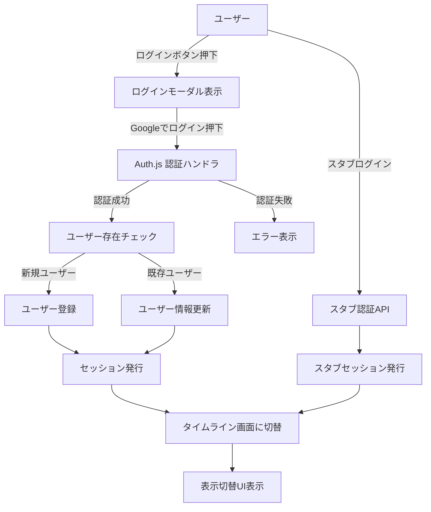

※機能の詳細はmermaidに書く

## 開発プロセス／開発方針

- 依存管理およびスクリプト実行には pnpm（Voltaでバージョン固定）を用いる
- テスト駆動開発で実装する
    - Red → Green → Refactor

## スタブ／本番切り替え方針

- CRUD 処理およびログイン処理は、
	- 開発環境: スタブ／モックを利用して UI・ロジックを先行実装する
	- 本番環境: Prisma / Auth.js への本番実装のみを呼び出す
という形で環境ごとに明確に分離する。

- スタブと本番実装の切り替えは環境変数で行い、アプリコードからは接続ポイントファイル（例: lib/authAdapter.ts, lib/postRepository.ts）を経由してのみアクセスする。

## 設定ファイル構成

- 本番: .env
- ローカル: .env.local

## インフラ構成／アーキテクチャ設計

- 環境
	- local: Next.js dev + ローカルPostgreSQL（スタブ可）
	- test(CI): Next.js build + テスト用PostgreSQL、スタブ無効
	- stg(任意): Vercel + Neon + Auth.js（本番同等、E2E用）
	- prod: Vercel + Neon + Auth.js

- ホスティング/ネットワーク
	- Vercel（Nodeランタイム想定。edgeは使用しない）
	- CDN/静的アセット配信は Vercel CDN に委譲
	- カスタムドメイン/HTTPS は Vercel で終端

- DB
	- Neon (PostgreSQL 17)
	- 接続URL: `DATABASE_URL`（pool/PgBouncer）、`DATABASE_DIRECT_URL`（migrate用）
	- Migration: GitHub Actions で `prisma migrate deploy`（差分がある場合のみ実行）

- 認証
	- Auth.js (Google OAuth)
	- Route Handlers でサインイン/コールバック/セッション発行を実装
	- Cookieベース（JWTセッション）、本番は Secure / SameSite=Lax を前提

- 環境変数/Secrets管理
	- prod/stg: Vercel の Environment Variables に登録
	- CI: GitHub Secrets（`DATABASE_DIRECT_URL` / `VERCEL_DEPLOY_HOOK_URL` など）
	- local: `.env.local`（gitignore）、サンプルは `.env.example`

- デプロイ/CI
	- main への push で GitHub Actions: `prisma migrate deploy`（差分がある場合のみ）→ Vercel Deploy Hook
	- preview: 必要に応じて Vercel Preview Deploy を利用

### DBマイグレーション運用フロー（開発→本番）

目的: Prisma schema（DB構造）の変更を、開発環境から本番環境まで **安全に・再現可能に**反映する。

- 開発（ローカル）
	- 1) 機能追加に伴い Prisma schema を更新する
	- 2) ローカルDBに対してマイグレーションを **作成・適用**する（例: `prisma migrate dev`）
	- 3) 生成されたマイグレーション（`prisma/migrations`）をコミットする
- 本番反映（リリース）
	- 1) main へ反映（マージ）する
	- 2) GitHub Actions が、本番DBに対してマイグレーションを **適用のみ**行う（`prisma migrate deploy`）
	- 3) マイグレーション適用後に Vercel Deploy Hook を実行し、アプリをデプロイする

- 禁止/注意
	- 本番DBに対して `prisma migrate dev`（マイグレーションの作成）は実行しない（本番では **deploy（適用）**のみ）
	- `DATABASE_URL`（アプリ実行・pool）と `DATABASE_DIRECT_URL`（migrate用）の役割を混同しない
	- Secrets の登録先は方針に従い分離する（local: `.env.local`、CI: GitHub Secrets、stg/prod: Vercel Environment Variables）

- ログ/モニタリング（最小）
	- Vercel のログ
	- 追加する場合: Sentry/Logflare 等（未決）

- キャッシュ/パフォーマンス
	- クライアント: TanStack Query でキャッシュ・再検証
	- サーバー側キャッシュは特に設けず、CDN は静的アセットのみ

- バックアップ/リストア
	- Neon の自動スナップショットを利用（詳細は Neon 設定に従う）

## 認証・データ処理アーキテクチャ概要

- 認証: Route Handlers（`app/api/auth/[...nextauth]/route.ts`）で Auth.js を用い、サインイン／コールバック／セッション発行を担当する。
- CRUD: Server Actions + TanStack Query で非同期処理を行い、Prisma Repository 経由で DB にアクセスする。UI のキャッシュ／再検証は TanStack Query に委譲する。
- 接続ポイント: 認証は `authAdapter`、CRUD は `postRepository` から呼び出し、環境変数でスタブ／本番を切り替える（本番ではスタブを無効化するガードを入れる）。

### リスクと対策（認証スタブ）

- フェーズ1では Auth.js 本番実装が未着手のため、`/api/auth/stub` + HTTP-only Cookie で簡易セッションを保持している。
- HTTP-only Cookie であるためフロントエンドの JS からは読み取れないが、ブラウザの開発者ツール上では値を確認できる。「開発環境のみ」「スタブユーザーしか生成されない」前提で使用する。
- 本番デプロイ時（`NODE_ENV=production`）にスタブが有効化されないよう `NEXT_PUBLIC_USE_STUB_AUTH` + ガードを必須化し、CI では `NODE_ENV=test` でスタブを無効化して Route Handler + Auth.js を呼び出す。
- **P1-RSK-01:** ドキュメント／CI 設定に上記前提を明記し、開発者限定の利用に留める。
- **P2-AUTH-01:** Auth.js 本番接続が完了したらスタブ Cookie を削除し、Google OAuth → Route Handler → DB セッションで統一してリスクを根本的に排除する。

## スタブ／モック設計

- 開発環境と本番環境の切り替え
	- 開発環境ではスタブとモックで製造する。
	- 本番環境にデプロイする際は強制的にスタブとモックを排除する設計とする
	    - **ToDo:** 実装内容の詳細は別途検討する

## 環境とスタブ／本番実装の使い分け

- 開発環境（ローカル）
  - UI・ロジックはスタブ認証／スタブCRUD経由で実装・検証する。
  - Server Actions や Prisma の CRUD は、テスト用 PostgreSQL（ローカル）に対して単体テストや API レベルのテストから本物実装を呼び出して確認する。
- テスト環境（CI / `NODE_ENV=test`）
  - スタブは無効化し、本物の Auth.js + テスト用 DB を利用する。
  - 「認証＋Server Actions＋DB＋UI」がつながる結合テストをここで実行する。
- ステージング環境（任意）
  - 本番と同様の構成（Vercel + Neon + Auth.js）を用意し、E2Eテストでブラウザ操作ベースの確認を行う。
- 本番環境
  - 常に本物の Auth.js + Neon DB のみを利用し、スタブは無効化する。

## 設定・環境変数設計

| key                  | .env            | .env.local | 備考                                                              |
| -------------------- | --------------- | ---------- | --------------------------------------------------------------- |
| DATABASE_URL         | Neonのpooling    | ローカルDBのURL |                                                                 |
| DATABASE_DIRECT_URL  | Neonのpooling無し  |            |                                                                 |
| AUTH_SECRET          | localとは異なる値     | 本番とは異なる値   | [公式のコマンドで生成する](https://authjs.dev/guides/environment-variables) |
| GOOGLE_CLIENT_ID     | GoogleCloudから取得 | スタブ        |                                                                 |
| GOOGLE_CLIENT_SECRET | GoogleCloudから取得 | スタブ        |                                                                 |

## 採用技術・構成技術

- アプリ
    - Next.js v15（Turbopackは使わない、install時のオプションはすべてデフォルトにする）
    - Biome
    - tiptap — 投稿エディタのリッチテキスト入力に使用。投稿本文は tiptap の JSON 形式で DB に保存する
    - prisma
    - dayjs — 投稿の作成日・更新日の日時フォーマット表示に使用
    - TanStack Query — 投稿一覧のキャッシュ・再検証・無限スクロールのデータ取得に使用（詳細は「投稿一覧取得・キャッシュ戦略」を参照）
    - dnd-kit — 投稿の手動並び替え（ドラッグ&ドロップ）に使用
- デザインシステム
	- storybook（将来的に導入）
- テスト
    - Jest
- UI
    - shadcn/ui
    - tailwindcss
    - next-themes — 外観（テーマ）切替に使用（詳細は「外観（テーマ）設計」を参照）
- アイコン
	- https://lucide.dev/
- DB
    - PostgreSQL v17
- 認証
    - Auth.js

## UI(shadcn/ui)

- 本プロジェクトの共通UIは **shadcn/ui をCLIで追加して利用**する（手動実装を避ける）。
- 公式ドキュメント（実装/利用方法）は以下を参照する。
	- button: https://ui.shadcn.com/docs/components/button
	- dialog: https://ui.shadcn.com/docs/components/dialog
	- alert: https://ui.shadcn.com/docs/components/alert
	- alert-dialog: https://ui.shadcn.com/docs/components/alert-dialog
	- popover: https://ui.shadcn.com/docs/components/popover
	- spinner: https://ui.shadcn.com/docs/components/spinner
	- sonner: https://ui.shadcn.com/docs/components/sonner
	- checkbox: https://ui.shadcn.com/docs/components/checkbox

## ブレイクポイント（Tailwindデフォルト）

- `md`: 768px （本プロジェクトでは Tailwind のデフォルト値を採用）

## 外観（テーマ）設計（next-themes）

### 方針

- アプリ全体の外観（`system` / `light` / `dark`）は **next-themes** で管理する。
- Tailwind の `dark:` を利用するため、Theme の反映は **class strategy**（`attribute="class"`）を採用する。

### 配置（RootLayout）

- `ThemeProvider` は RootLayout 配下でアプリ全体をラップする（Providerの外側で `useTheme()` を呼ばない）。
- 推奨設定（例）
  - `attribute="class"`
  - `defaultTheme="system"`
  - `enableSystem`
  - `disableTransitionOnChange`（必要なら）
- hydration 差分が出る場合は `html` に `suppressHydrationWarning` を付与する（必要な場合のみ）。

### ライブラリ連携（sonner）

- `sonner` の Toaster は `useTheme()` の値を `theme` として渡すため、**必ず ThemeProvider 配下**でレンダリングされる構造にする。

### 文字サイズ切り替え

- `fontScale` は `normal` / `large` / `xlarge` の 3 段階を想定。`User.fontScale` とブラウザ `localStorage` の両方に保存し、サインアウト時も直近の設定を保持する。
- RootLayout で `data-font-scale` 属性を `html` に付与し、Tailwind の `@layer base` で `:root[data-font-scale="large"] { font-size: 1.1rem; }` のようにスケールを制御する。
- クライアントでは `useTheme()` と同様の `useFontScale()` フックを用意し、Popover 内の UI から `setFontScale("large")` を呼び出して `localStorage` → Server Action で `User` テーブルを更新する。
- テーマ切替 UI と同じくフェーズ1で基盤を整え（ThemeProvider 内で context を提供）、フェーズ2で UI + テストを実装する。

### 段階的導入（運用）

- フェーズ1: ThemeProvider の導入（基盤）を先行し、後続の UI 実装で手戻りが出ない状態を作る（切替UIは別タスク）。
- フェーズ2: テーマ切替UI（system/light/dark）と永続化、回帰テストを実装する（チェックリスト `P2-APP-01`）。

## UI設計方針（Miro連携）

- Miro ボード上のフレーム／アイテム情報を取得し、レイアウト構造や要素の優先度を設計のインプットとして活用する。
- 座標やサイズをピクセル単位で再現せず、並び順・まとまり・文言を参考にレスポンシブな構造を優先する。
- コンポーネント設計時は Miro 情報を要件定義書と照合し、TDD でスナップショット／挙動テストを先に書いてから実装する。
- Miro 側に更新が入った場合は差分を確認し、必要に応じて UI 設計を更新する。

## ページレイアウト（Miro準拠）

- ヘッダー:
  - 常に表示
  - 画面スクロール時も最上部に固定（position: sticky / top: 0）
- メイン:
  - 未ログイン:
    - メインタイトル
    - ログインボタン
    - このアプリについて
    - 免責事項
    - Link
      - 見出し要素にsr-onlyクラスを付ける
      - SNSアイコンはlucide-reactを使用して設置する アイコンのみ、テキストラベルは不要 アイコンにはaria-labelを付ける
      - お問い合わせはボタンとして設置する
      - github (https://github.com/kouichi-hoshi)
      - X (https://x.com/stella_d_tweet)
      - お問い合わせ (https://stella-d.net/#contact)
  - ログイン中:
    - エディタと投稿一覧。md未満は縦並び、md以上は左右分割でエディタを固定。
- フッター:
  - 未ログイン: 表示する
  - ログイン中: 非表示にする

## コンポーネント構成

## コンポーネント: ヘッダー

- 共通
  - アプリ名を左寄せで表示する
- 未ログイン
  - 未ログイン時: ログインボタン（右寄せ）
  - ログイン中（md未満）: ユーザーアイコン（右寄せ）
  - ログイン中（md以上）:
    - 表示切替（センターに配置）
    - ユーザーアイコン（右寄せ）

## コンポーネント: ログインボタン

- ボタン押下でログイン用モーダルウィンドウを表示する
- モーダル内に「Googleでログイン」ボタンを表示する
- ログインボタンを押下すると認証処理を実行する。成功したら、未ログイン用のウェルカムメッセージ／ログインボタンを非表示にし、ログイン中画面に遷移する
- モーダルの右上のバツボタンを押下するとモーダルが解除される

## コンポーネント: ユーザーアイコン

- ユーザーアイコン押下でポップオーバーを開き、ユーザー名と「ログアウト」リンクを表示する
- ポップオーバーに「日記モードを有効にする」トグルを追加し、日記モードの表示/非表示を切り替えられること
- 日記モードの設定はデータベースのユーザー設定テーブルに保存される
- ユーザーアイコンまたはポップオーバー以外のエリアをクリックすると閉じる

## コンポーネント: ウェルカムメッセージ

表示する文章は [06. 表示テキスト定義](./06.%20表示テキスト定義.md#ウェルカムメッセージ) を参照。

## コンポーネント: 投稿エディタ

### UI構成

- テキスト入力フィールド（tiptap）
- 入力欄の下に、左から順に以下のUIを配置する
  - モードチェックボックス
    - 「メモ」「ToDo」の2種類（日記モードが有効な場合は「日記」も表示する）
    - 初期値は「メモ」
  - 保存ボタン
    - 新規投稿時: ラベル「保存」
    - 編集時: ラベル「更新」
  - キャンセルボタン（既存投稿の編集時のみ表示）

### 初期化処理

- 新規投稿か既存投稿の編集かを判定

### 新規投稿

- 初期設定モードをセットする
- 空のエディタを表示する
- エディタをフォーカスする
- UI操作: 保存ボタンを押下
  - アクティブになっているモードを取得する
  - 日記モードが無効な場合はモードチェックに「日記」を表示しない（選択不可）
  - エディタに入力された内容を取得する
  - 取得したデータをデータベースに登録する
  - 投稿一覧の現在のキャッシュに投稿を追加する
  - 保存完了後の状態
    - エディタの入力内容をクリアする
    - 再びエディタにフォーカスを当てる
    - 「保存しました」フィードバックメッセージを表示する
    - モードを変更した場合、表示内容が新しいモードに合わせて切り替わる
  - エディタが空の場合は保存を行わず、Alertで未入力であることを通知する

### 新規投稿保存フロー

**ポイント**:
- バリデーション失敗時は Alert、create失敗時は sonner.error + 状態維持で再入力しやすくする
- 保存後は現在のクエリキー（`["posts", { mode, view, tags }]`）を `setQueryData` で更新し、キャッシュとUIを同期させる
- エディタクリア + フォーカス戻しで連続入力を容易にする
- 表示中の mode/view/tags と保存投稿の属性が一致する場合のみ即時反映し、不一致の場合はモード切替時に表示する
- `view=trash` 表示やタグフィルタ中は、対応するクエリキー（例: `["posts", { view: "trash" }]`）には影響を与えず、通常一覧のキーのみ更新する

### 既存投稿の編集

- 既存投稿のモードをセットする
- 既存投稿の投稿内容をエディタにセットする
- UI操作: 更新ボタンを押下
  - 保存処理と同様の流れで更新を実行
  - 日記モードが有効な場合はモードチェックに「日記」も含めて選択できる
  - 「更新しました」フィードバックメッセージを表示する
- UI操作: キャンセルボタンを押下
  - 編集状態から通常表示に戻る
  - 新規投稿用エディタを表示する

## コンポーネント：投稿一覧

- 初期化処理
	- スピナーをフェードイン
	- 取得すべきモードを取得
	- 該当するモードの直近n件をロードしTanStack Queryのキャッシュに登録
	- スピナーをフェードアウトする
	- 同時に下記を実行
		- モードタイトル（表示または差し替え）
		- 投稿並び替え機能を初期化する
		- 投稿ソート機能を初期化する
		- 投稿一覧をフェードイン
	- 未取得の投稿がある場合は、無限スクロール形式で続きを取得し表示する

### 無限スクロール

- ページ最下部の 100px 手前までスクロールしたとき、次の n 件をロードし、ロード完了後に続きとして表示する
-  n件表示後、画面最下部の100px手前に到達すると、次のn件をロードし、ロードが完了すると表示する（無限スクロール）
- 投稿をロードするはスピナーによる演出を発生させ、投稿を読み込んでいることをユーザーに認知させる
- 全件ロードしたら[すべての投稿を取得しました]とメッセージを表示し、以後はスピナーを表示させない
- スピナーのマウント／アンマウントに関わらず表示領域の高さを確保し、レイアウトシフトが発生しないようにする
- フェーズ1では postRepository スタブ（固定データ）＋ IntersectionObserver で無限スクロール UI の挙動を完成させ、フェーズ2で Prisma + Server Actions + Cursor ベースの本番処理に差し替える

### 投稿ソート機能

- グループ1と2の組み合わせでソートする
	- グループ1: 更新順、投稿順（フェーズ1）、手動並び替え順（フェーズ2）
	- グループ2: 昇順、降順
- フェーズ1では「更新順／投稿順 × 昇順／降順」をスタブデータで実装する
- 「手動並び替え順」は手動並び替え機能（フェーズ2）に依存するため、フェーズ2で実装する

### 投稿並び替え機能（ドラッグ&ドロップ）【フェーズ2】

- dnd-kitを使って実装する
  - 画面サイズmd以上でのみ使用可能とする
- 上下移動ボタン（+/-）による1件ずつの移動もフェーズ2で実装する
- 並び順は本番DBに永続化し、再読込後も維持する

## コンポーネント: スピナー

- UIはshadcnのスピナーを使う
- https://ui.shadcn.com/docs/components/spinner
- 処理開始: スピナーをマウント、1秒かけてフェードイン
- 処理終了: 1秒かけてフェードアウト、スピナーをアンマウント

## コンポーネント：投稿一覧 個別投稿

### 表示要素

- 所属するモード（メモ／ToDo／日記）
- 更新日（投稿日）
- 投稿本文
- ドラッグ&ドロップ用のツマミ（ハンバーガーアイコン、md以上かつポインティングデバイスで表示）【フェーズ2】
- 上下移動ボタン（+/-）で1件ずつ移動【フェーズ2】
- 編集ボタン
  - 押下すると、その投稿の表示領域をエディタに差し替える
  - 差し替わったエディタ内にはその投稿の内容が表示され、編集可能状態になっている
  - 編集用エディタにはモードチェックボックス、キャンセルボタン、更新ボタンを表示する（日記モードが有効な場合は「日記」も含めて選択できる）
- ゴミ箱アイコン
  - 押下でその投稿をゴミ箱に移動する
  - ゴミ箱に移動した投稿の status は trashed になる
  - 一覧から表示が消える

## タグ機能設計

### 基本方針

- タグはユーザー単位で管理し、1 投稿に複数タグを付与できる（多対多）。
- 登録/更新/削除 UI はフェーズ2で投稿エディタの下部に配置し、`tagSelector` コンポーネントを通して `postRepository` を呼び出す。
- CRUD は `postRepository` → `tagRepository`（予定）で抽象化し、スタブ／本番の切り替えは既存の環境変数フラグを使う。

### フィルタリング

- 表示切替UIに「タグフィルタ」ボタンを追加し、押下でポップオーバーを開いて複数タグを選択できる。
- URL クエリ `tags=tagId1,tagId2` で状態を保持し、戻る／進むで復元できるようにする（`mode` / `view` と同様に `searchParams` を監視）。
- TanStack Query のキーは `{ mode, view, tags }` を含むオブジェクトに拡張し、タグの組み合わせごとにキャッシュを保持する。

### キャッシュ／永続化

- 投稿保存時は `postRepository.create` / `update` の入力に `tagIds: string[]` を含め、Server Action 側で PostTag を upsert する。
- ゴミ箱移動・復元・削除時も関連するクエリキーを無効化してタグ付き一覧と整合させる。

## コンポーネント: 表示切り替え

- 配置:
  - md以上（タブレット・PC）: ヘッダー内
  - md未満（モバイル）: 画面の下部に固定
- 「すべて」ボタン
- 「メモ」ボタン
- 「ToDo」ボタン
- 「日記」ボタン（日記モードが有効な場合のみ表示）
- 「ごみ箱を見る」リンク
- 初期設定では「すべて」がアクティブになっている
- 「すべて」は日記モードが有効な場合、日記も含む
- 各モードとごみ箱はパラメーターで判定し、ブラウザでの進む/戻るで状態を保存できるようにする
  - 「すべて」表示も `mode=all` としてクエリパラメータで明示し、`searchParams` を監視して状態を復元できるようにする
	- /?mode=memo → メモのみ表示
	- /?mode=todo → ToDoのみ表示
	- /?mode=diary → 日記のみ表示（日記モード有効時）
	- /?mode=all → すべて表示（日記モード有効時は日記も含む）
	- /?view=trash → ゴミ箱表示
- タグやごみ箱を切り替えても、そのときの投稿一覧の内容をキャッシュして状態を復元できるようにする

### 表示切替フロー

**ポイント**:
- URL（searchParams）が唯一の真実（Source of Truth）
- UI状態は searchParams から導出
- TanStack Query のキャッシュで戻る/進む時に即座に復元
- クエリ変更は mergeSearchParams で既存の view/tags などを保持したまま差し替える
- 「ごみ箱を見る」リンク・日記モード・タグフィルタも searchParams ベースで分岐し、同一フローでキャッシュ復元する
- ボタン押下は URL 更新のみ（直接的な状態変更は行わない）

## コンポーネント: Link
- 外部リンク
  - GitHubアイコン: リポジトリへのリンク
  - Xアイコン: X（旧Twitter）へのリンク
  - 「お問い合わせ」リンク

## コンポーネント: フッター
- コピーライト表示

## コンポーネント: ゴミ箱

### 概要

- ゴミ箱には status が `trashed` の投稿を表示する
- ゴミ箱表示画面では、通常の投稿一覧と同じレイアウトの一覧コンポーネントを利用する
- ゴミ箱内一覧を表示していても、通常の投稿一覧のキャッシュ状態は保持する（元の一覧画面に戻ったときに状態を復元できる）

### ゴミ箱一覧上部のインターフェース

- 「表示されている投稿を選択」チェックボックス
  - チェックを入れると、現在表示されている投稿すべてにチェックを付ける
  - チェック状態ではラベルを「n件選択中」のように切り替える
  - チェック状態のときのみ「選択した投稿を削除」ボタンを表示する
- 「選択した投稿を削除」ボタン
  - 押下で削除確認モーダルを開く
  - モーダルで「n件の投稿を完全に削除しますか?」とメッセージを表示する
- 「ごみ箱を空にする」ボタン
  - 押下で削除確認モーダルを開く
  - モーダルで「ゴミ箱内のすべての投稿を完全に削除しますか？」とメッセージを表示する
  - 対象はロード済み／未ロードを問わず、status が trashed の投稿すべてとする

### 削除確認モーダル

- 確認メッセージ（例：n件の投稿を完全に削除しますか?）
- 警告メッセージ（この操作は取り消せません）
- キャンセルボタン：モーダルを閉じる
- 削除ボタン：対象の投稿を完全に削除し、「投稿を削除しました」sonner通知を表示する

### ゴミ箱内の各投稿の要素

- 選択用チェックボックス
  - チェック状態に応じてラベルを「n件選択中」に更新する
- 復元ボタン
  - 押下で status を `active` に変更し、ゴミ箱一覧からは非表示にする
- 削除ボタン
  - 押下でその投稿を完全削除し、「投稿を削除しました」sonner通知を表示する

## 認証フロー設計

- 認証方式
  - Auth.js を利用し、Google を IdP としたシングルサインオンを行う
  - セッション方式は JWT ベースとする
- 実装ポイント
  - 認証処理は Route Handlers で実装する
  - ログインボタン押下 → ログインモーダル → 「Googleでログイン」押下 → Auth.js による認証フローへ遷移
- ユーザー登録・更新
  - 新規ユーザー
    - 認証成功時、スキーマに従い User テーブルにレコードを作成する
  - 既存ユーザー
    - 認証時のメールアドレスと DB 上のメールアドレスを比較し、異なる場合は更新する

- 認証失敗やユーザーキャンセル時は `AuthFail` に遷移し、モーダル内でエラーメッセージ表示または閉じて未ログイン画面へ戻る。
- フェーズ1は `/api/auth/stub` によるスタブセッション（開発専用 Cookie）を利用し、フェーズ2で Auth.js に差し替える。
- 成功時はセッション発行後に UI がリダイレクトまたは `router.refresh()` で更新され、表示切替UIを含むログイン後レイアウトを描画する。

## セッション取得とUI更新方針

- 判定レイヤー: ミドルウェアでセッション有無を確認し、未ログイン／ログイン中で画面を出し分ける。
- サーバー側: Server Component や Route Handler で `auth()` を呼び、セッションを取得して UI に渡す。
- クライアント側: `next-auth/react` の `useSession()` をヘッダーやログインボタン、ユーザーアイコンなどで利用し、表示分岐やポップオーバーを制御する。
- 更新タイミング: サインイン／サインアウト後はリダイレクト、または `router.refresh()` 等でセッションを再取得し UI を更新する。
- 役割分担: Route Handlers は認証フロー（リダイレクト／セッション発行）、Server Actions は認証済みリクエストとして `auth()` 情報を参照して CRUD を実行、UI はセッション状態に応じて表示を切り替える（ログインボタンに独自の状態チェック処理は不要）。

## データモデル設計（DB）

### User テーブル

- `userId`: アプリ内部の主キー（ULID）。他テーブルからの参照先
- `googleSub`: Google が返す `sub` を格納する
- `email`: ユーザーのメールアドレス
- `name`: ユーザー名
- `diaryEnabled`: 日記モードの有効/無効（Boolean、デフォルト false）
- `fontScale`: UI の文字スケール。`"normal"` / `"large"` / `"xlarge"` を想定し、デフォルトは `"normal"`。未設定時は `normal` として扱う
- `posts`: ユーザーが作成した Post との 1 対多リレーション（論理フィールド、実テーブル列ではない）
- `createdAt`: 作成日時（自動付与）
- `updatedAt`: 更新日時（変更時に自動更新）

### Post テーブル

- `postId`: 投稿の主キー（Auto increment）
- `authorId`: 投稿者の `User.userId` への外部キー
- `author`: User へのリレーション（論理フィールド、実テーブル列ではない）
- `contentJSON`: 投稿本文（tiptap の JSON を文字列として保存）
- `status`: 投稿の状態
  - `active`: 通常の投稿
  - `trashed`: ゴミ箱に入っている状態
- `mode`: 投稿の種類（`memo` / `todo` / `diary`）。一覧の絞り込みに使用
- `createdAt`: 作成日時（自動付与）
- `updatedAt`: 更新日時（変更時に自動更新）
- `deletedAt`: ゴミ箱移動日時（ソフト削除の指標。復元で `null` に戻す。ゴミ箱一覧の並び替えにも使用）

### Tag テーブル

- `tagId`: タグの主キー（ULID）
- `ownerId`: `User.userId` への外部キー。ユーザーごとのカスタムタグを管理する
- `label`: タグ名（ユニーク制約は `ownerId` + `label` の組み合わせに付与）
- `createdAt` / `updatedAt`

### PostTag テーブル（中間）

- `postId`: Post への外部キー
- `tagId`: Tag への外部キー
- `sortOrder`: タグ表示順を将来的に制御するための数値（デフォルト 0）
- 複合ユニーク制約: (`postId`, `tagId`)

> 備考: フェーズ2で Tag/ PostTag を有効化するまでは Prisma schema 上で `@@map` を用いてスタブと本番を同じ API で扱えるようにする。

## 投稿一覧取得・キャッシュ戦略（TanStack Query）

- クエリキー設計
  - 表示モード（`mode=all|memo|todo|diary`）とビュー（通常／`view=trash`）に加え、選択中の `tags`（配列）を含めて TanStack Query のクエリキーを分ける
  - 例: `["posts", { mode: "memo", view: "normal", tags: [] }]`, `["posts", { mode: "all", view: "normal", tags: ["tagA"] }]`, `["posts", { view: "trash" }]` など
- キャッシュ方針
  - 各クエリキーごとに取得した投稿一覧をキャッシュし、表示切替・タグ切替・ゴミ箱表示時に状態を即時復元できるようにする
  - 投稿をゴミ箱に移動／復元した場合は、関連するクエリキーのキャッシュを更新し、UI と整合を取る

## エラー通知実装設計

### エラー種別

各機能実行時には適切なエラーハンドリングを行い、必要に応じてユーザーにフィードバックする。

- 認証エラー：ログインが必要な操作で未認証の場合
- 認可エラー：権限のない操作を試みた場合
- Not Found エラー：対象のリソースが存在しない場合
- バリデーションエラー：入力値が不正な場合
- サーバーエラー：サーバー側で予期せぬエラーが発生した場合
- 一般的なエラー：上記に分類されないエラー
- 成功メッセージ：操作が正常に完了した場合

エラーや成功メッセージはsonnerで表示し、ユーザーが現在の状態を理解できるようにする。

### 開発環境用エラーシミュレーション

- 開発環境のみ有効なエラー通知シミュレーション機能を実装する
- 実装方針
  - クエリパラメータ `errorTest` を監視し、値に応じて対応するsonner通知を表示する
    - `http://localhost:3000/?errorTest=auth` → 認証エラー
    - `http://localhost:3000/?errorTest=authorization` → 認可エラー
    - `http://localhost:3000/?errorTest=notfound` → Not Found エラー
    - `http://localhost:3000/?errorTest=validation` → バリデーションエラー
    - `http://localhost:3000/?errorTest=server` → サーバーエラー
    - `http://localhost:3000/?errorTest=generic` → 一般的なエラー
    - `http://localhost:3000/?errorTest=success` → 成功メッセージ
  - sonner通知表示後、`errorTest` クエリパラメータを URL から削除し、リロードしても再発火しないようにする
  - `process.env.NODE_ENV === "production"` の場合、この機能は無効化する
- 実装場所
  - クライアントコンポーネントまたは `useEffect` 相当のカスタムフックで URL を監視し、sonner通知表示とパラメータ削除を行う

## 非同期処理の多重実行防止設計

- 対象となる操作
  - 投稿の削除
  - 投稿のゴミ箱投入
  - ゴミ箱からの復元
  - ゴミ箱を空にする／選択した投稿を削除する
- 方針
  - TanStack Query の Mutation の状態（`isPending` など）を利用し、実行中は該当ボタンを `disabled` にする
  - 連打による二重実行を防ぐため、同一対象に対する同一操作は、前のリクエスト完了を待ってから次を受け付ける

## セキュリティ対策

- XSS 対策
  - 入力値はサーバー側・クライアント側で適切にエスケープする
  - tiptap のコンテンツを表示する際は、危険な HTML をレンダリングしない方針をとる
- SQL インジェクション対策
  - Prisma ORM を利用し、生の SQL を極力書かない
- その他
  - 認証・認可エラー時の情報漏洩を避けるため、詳細な内部情報をユーザーに表示しない

## 非機能要件 / パフォーマンス・チューニング

- 現時点では詳細未定（ToDo）
- 無限スクロールやキャッシュ戦略により、タイムラインの体感速度をできるだけ維持することを目標とする

## テスト戦略（Jest, モック, スタブ）

- 方針: テスト基盤は Jest + React Testing Library を採用し、TDD（Red→Green→Refactor）で品質を担保する（具体的なタスク・完了条件は `docs/04. 作業計画書.md` / `docs/05. 作業計画進行チェックリスト.md` に集約する）。
- 方針: 統合テスト／E2E が必要になった段階で Playwright 等を採用し、フェーズ別のテスト範囲と完了条件をチェックリストに反映する。

- 環境ごとの方針
  - 開発環境ではスタブ／モックを中心に UI／ロジックを Red → Green で回す。
  - テスト環境（`NODE_ENV=test`）およびステージング環境ではスタブを無効化し、本物の認証・DB を用いた結合テスト／E2Eテストで最終確認を行う。

- 認証
  - サーバー側: `jest.mock("@/auth", () => ({ auth: jest.fn() }))` で `auth()` をモックし、未ログイン／ログイン時の分岐をテストする
  - クライアント側（必要に応じて）: `next-auth/react` の `useSession` などをモックし、UI 分岐をテストする
- DB
  - テスト用 PostgreSQL を用い、`DATABASE_URL=postgresql://.../mono_log_test?schema=public` などで接続する
  - 各テストで `deleteMany()` 等によりデータを初期化することで、Server Actions の CRUD を外部 API なしで検証可能にする
- UI
  - React Testing Library を用いて、エディタ・一覧・フォーカス／キャンセルなどの振る舞いを DOM レベルで検証する
- 外観（テーマ）
  - `next-themes` を利用するコンポーネントは `next-themes` を jest mock し、`setTheme` 呼び出し（`system` / `light` / `dark`）をユニットテストで担保する
  - `sonner` の Toaster は `ThemeProvider` 配下でレンダリングされること（構造の回帰）をスモークで担保する
- ネットワーク
  - テストでは外部 HTTP 呼び出し（特に Google OAuth）を実際には発生させない

## 単体テスト（例・ToDo 含む）

- エディタ
  - 保存
    - 正常:
      - 保存ボタン押下でデータベースに保存される
    - 準正常:
      - 保存時に JS コードがエスケープされる
    - 異常:
      - 保存上限文字数を超える入力時にエラーとなる（DB 設定依存のため要調査）
      - 未入力の場合にアラートが表示される
  - 読み取り
  - 更新
  - 削除
- ログイン
  - 未ログイン／ログイン済みでの画面分岐
- データベース接続
  - 接続エラー時のハンドリングなど

## 結合テスト（例・ToDo 含む）

- 投稿表示
  - 認証＋Server Actions＋DB＋UIを通した一連の表示を確認する
- ログイン
- ログアウト

## E2Eテスト

- Playwrightを使用した自動テストを行う予定（詳細はまだ未定）
- スピナーの表示・非表示によるレイアウトシフトの発生をテストする予定
- 外観（テーマ）切替の確認（実施する場合）
  - UI操作で `system` / `light` / `dark` が切り替わり、`html`（または `body`）の `dark` クラス反映が変わる
  - リロード後も選択が維持される（永続化）
