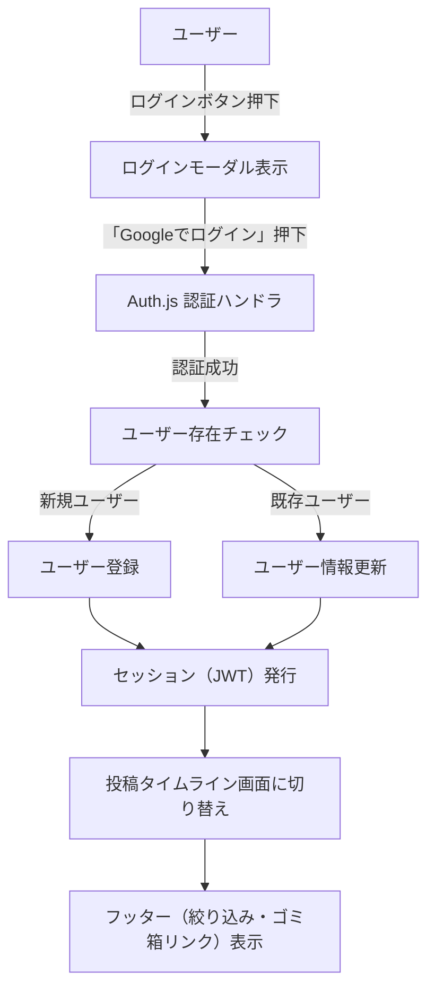

※機能の詳細はmermaidに書く

## 開発プロセス／開発方針

- 依存管理およびスクリプト実行には npm を用いる
- テスト駆動開発で実装する
    - Red → Green → Refactor

## スタブ／本番切り替え方針

- CRUD 処理およびログイン処理は、
	- 開発環境: スタブ／モックを利用して UI・ロジックを先行実装する
	- 本番環境: Prisma / Auth.js への本番実装のみを呼び出す
という形で環境ごとに明確に分離する。

- スタブと本番実装の切り替えは環境変数で行い、アプリコードからは接続ポイントファイル（例: lib/authAdapter.ts, lib/postRepository.ts）を経由してのみアクセスする。

## 設定ファイル構成

- 本番: .env
- ローカル: .env.local

## インフラ構成／アーキテクチャ設計

- 本番環境の構成
	- ホスティング: Vercel
	- DB: Neon
	- 認証: Auth.js
		- Google cloud

## アプリケーションアーキテクチャ（ユーザー認証とCRUD処理）

- データアクセス方式（Prisma + Repository）
	- データベースとの接続はPrismaを使用
- 非同期処理の流れ（Server Actions + TanStack Query）
	-  ServerActionとTanStack Queryを組み合わせてCRUD処理を行う。
	- ユーザー認証はRoute Handlersを使用する。

## スタブ／モック設計

- 開発環境と本番環境の切り替え
	- 開発環境ではスタブとモックで製造する。
	- 本番環境にデプロイする際は強制的にスタブとモックを排除する設計とする
	    - **TODO:** 実装内容の詳細は別途検討する

## 環境とスタブ／本番実装の使い分け

- 開発環境（ローカル）
  - UI・ロジックはスタブ認証／スタブCRUD経由で実装・検証する。
  - Server Actions や Prisma の CRUD は、テスト用 DB（SQLite やローカル PostgreSQL）に対して単体テストや API レベルのテストから本物実装を呼び出して確認する。
- テスト環境（CI / `NODE_ENV=test`）
  - スタブは無効化し、本物の Auth.js + テスト用 DB を利用する。
  - 「認証＋Server Actions＋DB＋UI」がつながる結合テストをここで実行する。
- ステージング環境（任意）
  - 本番と同様の構成（Vercel + Neon + Auth.js）を用意し、E2Eテストでブラウザ操作ベースの確認を行う。
- 本番環境
  - 常に本物の Auth.js + Neon DB のみを利用し、スタブは無効化する。

## 設定・環境変数設計

| key                  | .env            | .env.local | 備考                                                              |
| -------------------- | --------------- | ---------- | --------------------------------------------------------------- |
| DATABASE_URL         | Neonのpooling    | ローカルDBのURL |                                                                 |
| DATABASE_DIRECT_URL  | Neonのpooling無し  |            |                                                                 |
| AUTH_SECRET          | localとは異なる値     | 本番とは異なる値   | [公式のコマンドで生成する](https://authjs.dev/guides/environment-variables) |
| GOOGLE_CLIENT_ID     | GoogleCloudから取得 | スタブ        |                                                                 |
| GOOGLE_CLIENT_SECRET | GoogleCloudから取得 | スタブ        |                                                                 |

## 採用技術・構成技術

- アプリ
    - Next.js v15（Turbopackは使わない、install時のオプションはすべてデフォルトにする）
    - Biome
    - tiptap
    - prisma
    - dayjs
    - TanStack Query
- デザインシステム
	- storybook（将来的に導入）
- テスト
    - Jest
- UI
    - shadcn/ui
    - tailwindcss
- アイコン
	- https://lucide.dev/
- DB
    - PostgreSQL v17
- 認証
    - Auth.js

## UI(shadcn/ui)

 - button
 - spinner
 - popover
 - dialog
 - checkbox
 - alert
 - alert-dialog
 - toast

## コンポーネント構成

## コンポーネント: ヘッダー

- デフォルト
	- アプリ名を表示する
- 未ログイン
	- ログインボタンを表示する
	- ユーザーアイコンを非表示にする
- ログイン中
	- ログインボタンを非表示にする
	- ユーザーアイコンを表示する


## コンポーネント: ログインボタン

- ボタン押下でログイン用モーダルウィンドウを表示する
- モーダル内に「Googleでログイン」ボタンを表示する
- ログインボタンを押下すると認証処理を実行する。成功したら、未ログイン用のウェルカムメッセージ／ログインボタンを非表示にし、ログイン中画面に遷移する
- モーダルの右上のバツボタンを押下するとモーダルが解除される

## コンポーネント: ユーザーアイコン

- ユーザーアイコン押下でポップオーバーを開き、ユーザー名と「ログアウト」リンクを表示する
- ユーザーアイコンまたはポップオーバー以外のエリアをクリックすると閉じる

## コンポーネント: ウェルカムメッセージ

下記文章を表示する

```
### このアプリについて

アプリ開発の学習のために制作した、  
シンプルなメモ/ToDoアプリです。

どなたでも無料でお試しいただけます。  
機密情報等は入力しないようお願いします。

### 免責事項

このアプリは予告なく変更・削除される場合があります。  
アプリのご利用に際しては、すべて利用者の責任においてご利用ください。

```

## コンポーネント: 投稿エディタ

- 初期化処理
	- 新規投稿か既存投稿の編集かを判定

- 新規投稿
	- 初期設定タグをセットする
	- 空のエディタを表示する
	- エディタをフォーカスする
	- UI操作: クリアボタンを押下
		- エディタ内のテキストを削除する
	- UI操作: 保存ボタンを押下
		- アクティブになっているタグを取得する
		- エディタに入力された内容を取得する
		- 取得したデータをデータベースに登録する
		- 投稿一覧の現在のキャッシュに投稿を追加する

- 既存投稿
	- 既存投稿のタグをセットする
	- 既存投稿の投稿内容をエディタにセットする
	- ・・・
	- ・・・
	- ・・・


## コンポーネント：投稿一覧 

- 初期化処理
	- スピナーをフェードイン
	- 取得すべきカテゴリを取得
	- 該当するカテゴリの直近n件をロードしTanStack Queryのキャッシュに登録
	- スピナーをフェードアウトする
	- 同時に下記を実行
		- カテゴリタイトル（表示または差し替え）
		- 投稿並び替え機能を初期化する
		- 投稿ソート機能を初期化する
		- 投稿一覧をフェードイン
	- 未取得の投稿がある場合は、無限スクロール形式で続きを取得し表示する

### 無限スクロール

- ページ最下部の 100px 手前までスクロールしたとき、次の n 件をロードし、ロード完了後に続きとして表示する
-  n件表示後、画面最下部の100px手前に到達すると、次のn件をロードし、ロードが完了すると表示する（無限スクロール）
- 投稿をロードするはスピナーによる演出を発生させ、投稿を読み込んでいることをユーザーに認知させる     
- 全件ロードしたら[すべての投稿を取得しました]とメッセージを表示し、以後はスピナーを表示させない
- スピナーのマウント／アンマウントに関わらず表示領域の高さを確保し、レイアウトシフトが発生しないようにする

### 投稿ソート機能

- グループ1と2の組み合わせでソートする
	- グループ1: 更新順、投稿順、手動並び替え順
	- グループ2: 昇順、降順

### 投稿並び替え機能（ドラッグ&ドロップ）


## コンポーネント: スピナー

- UIはshadcnのスピナーを使う
- https://ui.shadcn.com/docs/components/spinner
- 処理開始: スピナーをマウント、1秒かけてフェードイン
- 処理終了: 1秒かけてフェードアウト、スピナーをアンマウント


## コンポーネント：投稿一覧 個別投稿

- ドラッグ&ドロップ用のツマミが
- ゴミ箱アイコン
	- 押下でその投稿をゴミ箱に移動する
	- ゴミ箱に移動した投稿の status は trashed になる

## コンポーネント: 表示切り替え

- 「すべて」ボタン
- 「メモ」ボタン
- 「TODOリスト」ボタン
- 初期設定では「すべて」がアクティブになっている
- 各カテゴリーとごみ箱はパラメーターで判定し、ブラウザでの進む/戻るで状態を保存できるようにする 
	- /?cat=memo → メモのみ表示 
	- /?cat=todo → TODOのみ表示
	- / → すべて表示（パラメーターなし）
	- /?view=trash → ゴミ箱表示
- タグやごみ箱を切り替えても、そのときの投稿一覧の内容をキャッシュして状態を復元できるようにする

## 認証フロー設計

- 認証方式
  - Auth.js を利用し、Google を IdP としたシングルサインオンを行う
  - セッション方式は JWT ベースとする
- 実装ポイント
  - 認証処理は Route Handlers で実装する
  - ログインボタン押下 → ログインモーダル → 「Googleでログイン」押下 → Auth.js による認証フローへ遷移
- ユーザー登録・更新
  - 新規ユーザー
    - 認証成功時、スキーマに従い User テーブルにレコードを作成する
  - 既存ユーザー
    - 認証時のメールアドレスと DB 上のメールアドレスを比較し、異なる場合は更新する



## データモデル設計（DB）

### User テーブル

- `userId`: アプリ内部の主キー（ULID）。他テーブルからの参照先
- `googleSub`: Google が返す `sub` を格納する
- `email`: ユーザーのメールアドレス
- `name`: ユーザー名
- `posts`: ユーザーが作成した Post との 1 対多リレーション（論理フィールド、実テーブル列ではない）
- `createdAt`: 作成日時（自動付与）
- `updatedAt`: 更新日時（変更時に自動更新）

### Post テーブル

- `postId`: 投稿の主キー（Auto increment）
- `authorId`: 投稿者の `User.userId` への外部キー
- `author`: User へのリレーション（論理フィールド、実テーブル列ではない）
- `contentJSON`: 投稿本文（tiptap の JSON を文字列として保存）
- `status`: 投稿の状態
  - `active`: 通常の投稿
  - `trashed`: ゴミ箱に入っている状態
- `cat`: 投稿の種類（`memo` / `todo`）。一覧の絞り込みに使用
- `createdAt`: 作成日時（自動付与）
- `updatedAt`: 更新日時（変更時に自動更新）
- `deletedAt`: ゴミ箱移動日時（ソフト削除の指標。復元で `null` に戻す。ゴミ箱一覧の並び替えにも使用）

## 投稿一覧取得・キャッシュ戦略（TanStack Query）

- クエリキー設計
  - 表示カテゴリ（`cat=all|memo|todo`）とビュー（通常／`view=trash`）の組み合わせごとに、TanStack Query のクエリキーを分ける
  - 例: `["posts", { cat: "memo", view: "normal" }]`, `["posts", { view: "trash" }]` など
- キャッシュ方針
  - 各クエリキーごとに取得した投稿一覧をキャッシュし、表示切替時やゴミ箱表示時に状態を即時復元できるようにする
  - 投稿をゴミ箱に移動／復元した場合は、関連するクエリキーのキャッシュを更新し、UI と整合を取る

## エラー通知実装設計

- 開発環境のみ有効なエラー通知シミュレーション機能を実装する
- 実装方針
  - クエリパラメータ `errorTest` を監視し、値に応じて対応するトーストを表示する
    - `auth` / `authorization` / `notfound` / `validation` / `server` / `generic` / `success` など
  - トースト表示後、`errorTest` クエリパラメータを URL から削除し、リロードしても再発火しないようにする
  - `process.env.NODE_ENV === "production"` の場合、この機能は無効化する
- 実装場所
  - クライアントコンポーネントまたは `useEffect` 相当のカスタムフックで URL を監視し、トースト表示とパラメータ削除を行う

## 非同期処理の多重実行防止設計

- 対象となる操作
  - 投稿の削除
  - 投稿のゴミ箱投入
  - ゴミ箱からの復元
  - ゴミ箱を空にする／選択した投稿を削除する
- 方針
  - TanStack Query の Mutation の状態（`isPending` など）を利用し、実行中は該当ボタンを `disabled` にする
  - 連打による二重実行を防ぐため、同一対象に対する同一操作は、前のリクエスト完了を待ってから次を受け付ける

## セキュリティ対策

- XSS 対策
  - 入力値はサーバー側・クライアント側で適切にエスケープする
  - tiptap のコンテンツを表示する際は、危険な HTML をレンダリングしない方針をとる
- SQL インジェクション対策
  - Prisma ORM を利用し、生の SQL を極力書かない
- その他
  - 認証・認可エラー時の情報漏洩を避けるため、詳細な内部情報をユーザーに表示しない

## 非機能要件 / パフォーマンス・チューニング

- 現時点では詳細未定（TODO）
- 無限スクロールやキャッシュ戦略により、タイムラインの体感速度をできるだけ維持することを目標とする

## テスト戦略（Jest, モック, スタブ）

- 環境ごとの方針
  - 開発環境ではスタブ／モックを中心に UI／ロジックを Red → Green で回す。
  - テスト環境（`NODE_ENV=test`）およびステージング環境ではスタブを無効化し、本物の認証・DB を用いた結合テスト／E2Eテストで最終確認を行う。

- 認証
  - サーバー側: `jest.mock("@/auth", () => ({ auth: jest.fn() }))` で `auth()` をモックし、未ログイン／ログイン時の分岐をテストする
  - クライアント側（必要に応じて）: `next-auth/react` の `useSession` などをモックし、UI 分岐をテストする
- DB
  - `DATABASE_URL=file:./test.db` の SQLite を用意し、テスト前に `prisma db push` でスキーマを反映する
  - 各テストで `deleteMany()` 等によりデータを初期化することで、Server Actions の CRUD を外部 API なしで検証可能にする
- UI
  - React Testing Library を用いて、エディタ・一覧・フォーカス／キャンセルなどの振る舞いを DOM レベルで検証する
- ネットワーク
  - テストでは外部 HTTP 呼び出し（特に Google OAuth）を実際には発生させない

## 単体テスト（例・TODO 含む）

- エディタ
  - 保存
    - 正常:
      - 保存ボタン押下でデータベースに保存される
    - 準正常:
      - 保存時に JS コードがエスケープされる
    - 異常:
      - 保存上限文字数を超える入力時にエラーとなる（DB 設定依存のため要調査）
      - 未入力の場合にアラートが表示される
  - 読み取り
  - 更新
  - 削除
- ログイン
  - 未ログイン／ログイン済みでの画面分岐
- データベース接続
  - 接続エラー時のハンドリングなど

## 結合テスト（例・TODO 含む）

- 投稿表示
  - 認証＋Server Actions＋DB＋UIを通した一連の表示を確認する
- ログイン
- ログアウト
